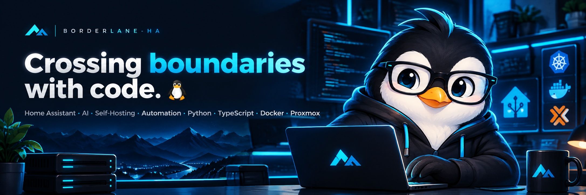

  

  Building open-source tools, integrations and dashboards 
  where <strong>automation, AI, infrastructure and connected systems meet.</strong>

  

---

## 🐧 Featured Projects

<table align="center">

<tr>
<td width="50%" align="center" valign="top">

</td>
<td width="50%" align="center" valign="top">

</td>
</tr>

<tr>
<td width="50%" align="center" valign="top">

</td>
<td width="50%" align="center" valign="top">

</td>
</tr>

<tr>
<td width="50%" align="center" valign="top">

</td>
<td width="50%" align="center" valign="top">

</td>
</tr>

<tr>
<td width="50%" align="center" valign="top">

</td>
<td width="50%" align="center" valign="top">

</td>
</tr>

<tr>
<td colspan="2" align="center" valign="top">

</td>
</tr>

</table>

  

---

## 🧰 Tech & Interests

 

---

## 💡 What I build

I enjoy building tools that connect systems which normally live in separate worlds.

From **Home Assistant integrations** and **energy dashboards** to  
**AI-powered applications**, **self-hosted services** and **homelab automation**.

My projects usually live somewhere between:

- 🏠 Home Assistant
- 🤖 AI & Local LLMs
- 🐳 Docker & Self-Hosting
- 🖥️ Proxmox & Homelab
- ⚙️ Automation
- 📊 Dashboards & Data
- 🔌 APIs & Integrations
- ⚡ Energy & Smart Home

---

## 🧪 Current Focus

Building practical open-source tools around:

**Home Assistant · AI · Self-Hosting · Automation · Python · TypeScript · Docker · Proxmox**

---

## 📦 All Projects

You can find the complete project overview here:

  

---

  <strong>Crossing boundaries with code. 🐧</strong>

  Automation · AI · Self-Hosting · Open Source

